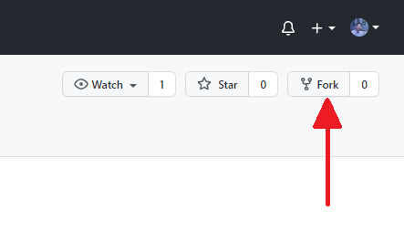
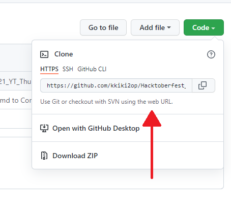

<p align="center">

 </p>

 <br>
 <br>

 


<br>

## Hacktoberfest 2022 Special

- We will be posting a problem daily at 10 AM related to languages like HTML/CSS, Python, C++ till 30th Oct.

- No need to get issues, you can directly attempt and submit by following instruction written in issue description.

- We will review comments, PRs raised at 5 PM and then 10 PM to provide feedback so that you can make necessary changes.

- You have time till 10 AM next day to submit, we will not accept any PR post this deadline.

- Make sure you take from latest code and don't edit any other file. 


Open source is changing the world- one pull request at a time.
Hactoberfest encourages participation in open source community, which grows bigger every year. 
Complete the 2022 challenge and earn a limited edition T-shirt.


## Steps to setup this Repository Locally

  1. Fork this repository to your account.



  1. Go to Git Bash and Clone the forked repository using :
       
       a. Clone the repository
```bash
   git clone https://github.com/your_username/make-pull-request
```


 1. Open the folder in your favourite code editor and add your changes or modifications.
 
## Creating a PR 
 
 1. After making changes or modification on to your code locally, you need to add these files to the staging area.
```bash
  git add <file-name>
```
 2. Once files added, you need to commit the changes to with an appropriate commit message.
```bash
  git commit -m "<your-message>"
```
 3. After commiting the changes, you need to push the changes
```bash
   git push origin <branch-name>
```
 4. Once you push the changes to your repository, the Compare & pull request button will appear in GitHub.

 5. Click it and you'll be taken to this screen

 6. Type a proper description and give the PR an appropriate title. Finally, Open a pull request by clicking the Create pull request button.

 7. That's it. You have opened a PR. Wait for it to get merged.


## Thank You for your Amazing Contribution!!


